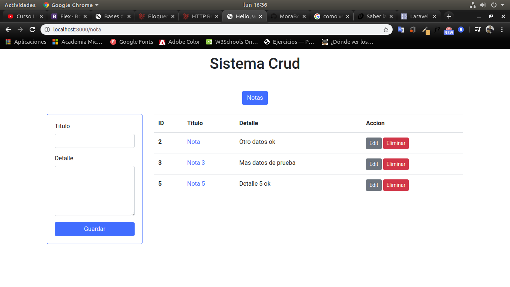

# Sistema para guardar notas

Sistema simple y minimalista para guardar notas con su descripcion, utilizando el framework laravel.

### Tecnologias
* Laravel 7.x
* Mysql
* Bootstrap

### Requisitos
Tener instalado laravel en tu pc.
Para verificar que tienes instalado laravel coloca el siguiente comando

```
php artisan --version
```

Tener instalado MySql

### Ejecutar proyecto
1.- Crear una base de datos
2.- Configurar los parametros de conexion del archivo .env
```
DB_CONNECTION=mysql
DB_HOST=127.0.0.1
DB_PORT=3306
DB_DATABASE=your-database-name
DB_USERNAME=root
DB_PASSWORD=password
```

Ejecutar las migraciones
```
php artisan migrate
```

Correr el servidor con serve
```
php artisan serve
```

En tu host local correr en el puerto 8000 -> Localhost:8000

